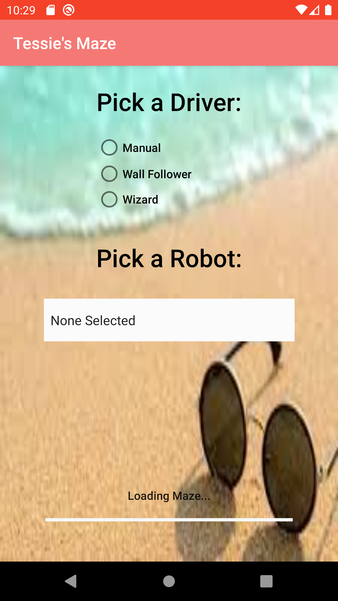
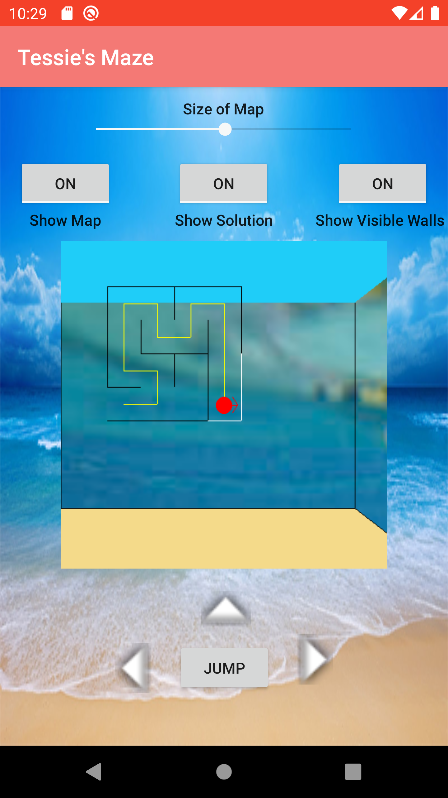
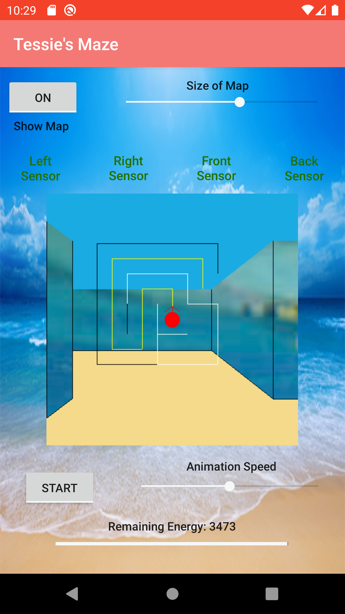
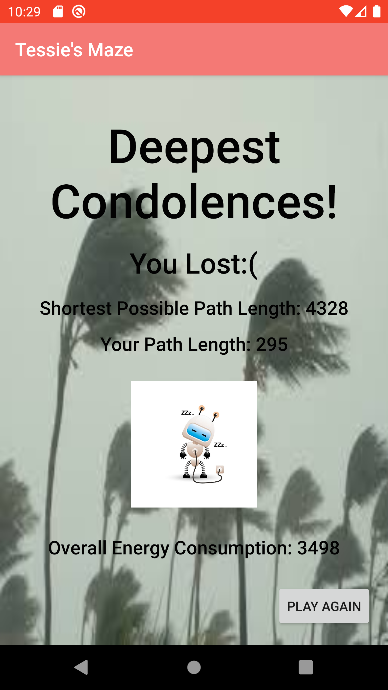

# Beach Maze App

This project is an app that allows a user to play a maze. In the first screen, the user can choose which maze generating algorithm they want, along with a difficulty level for the maze, and whether or not they want rooms. They also have the option of choosing to revisit the pervious maze they last visited. Once the user has put in their specifications for the maze, they are rredirected to the generating page, where they can pick whether or not they want a robot to complete the maze for them, and if so, which type of robot they want, or they can choose to play the game manually.

  

When the maze has loaded and the user has made their robot selections, the maze appears on their screen, either with controls for the user to play manually, or with a pause/start button and an option to speed up or slow down the robot. Both maze options allow the user to display the map on the maze and the one with the robot also shows which of the robots sensors are operational or broken, depending on the color of the sensor at the top of the screen.

  

If the user or robot exits out of the maze, they are redirected to the winning screen that shows their path length along with the shortest possible path length to take that does not include jumping over walls. On the other hand, if the robot crashes or runs out of energy in the maze, then the user is sent to the losing screen.

 

## What this project taught:
- This project was primarily written in java.
- The main code for the maze was originally written in Eclipse and then moved over to Android Studio and combined with a user interface completed in xml and java.
- This project offered additional practice with Gitlab, which is where all the changes were committed.
